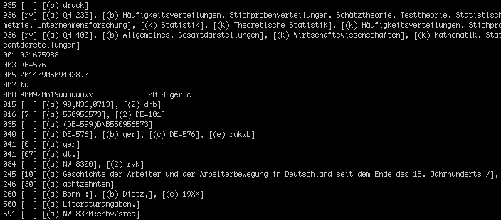
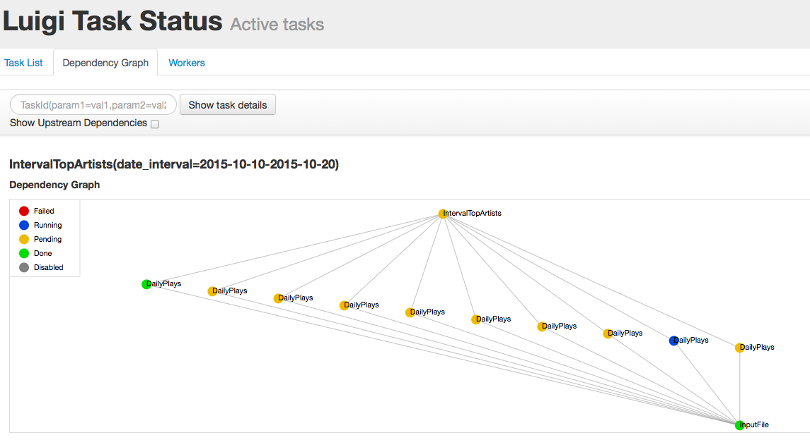
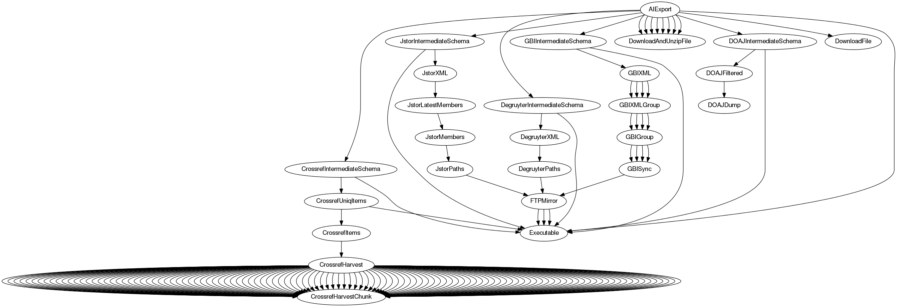

% Complex Workflows with Luigi
% [Martin Czygan](https://www.linkedin.com/in/martin-czygan-58348842) -- @[cvvfj](https://twitter.com/cvvfj) -- [github.com/miku](https://github.com/miku)
% LPUG -- Nov 10, 2015

# Hello World

* developer.{py, go, sh, js} at Leipzig University Library
* sometimes author or consultant


----

# Library data

> The current stock comprises over **five million volumes**; **5.2 million media units and around 7,200 current periodicals**. [...] In addition the library has a number of special collections, including around **8,700 manuscripts**, approx, **3,600 incunabula**, 16th century prints and around **173,000 autographs**.

But only 5-10% of the catalog is offline. We incorporate over 70 online
sources and currently building an aggregated index with about 100 million
records and growing.

Aggregated index currently around 300G including few full texts.

----

# Library data

- heterogeneous, mostly-structured, sometimes messy data



----

# Diversity

- FTP, HTTP, OAI-PMH, SCP, zips, tarballs, Google Docs or Spreadsheets
- XML, e.g. JATS, custom formats with or without schema, linked data, RDF, dublic core, licensing files
- JSON, many more lightweight formats, APIs around legacy systems
- MARC21
- data from MySQL database, SOLR or elasticsearch indices
- daily, weekly, monthly or other update cycles

----

# Abundant choices for pipeline tools

- [github.com/pditommaso/awesome-pipeline](https://github.com/pditommaso/awesome-pipeline) lists 64 projects across 5 categories, ranging from small tools to platforms and custom languages
- Python seems to be a popular language for these kind of tools, with some prominent examples being airflow, joblib or luigi
- other popular languages: Scala, R
- domains: bioinformatics, business reporting, data analytics, distributed computing and HPC
- core datastructure: the DAG

----

# Example problems

- Top artists from log files
- Top anything from accumulated logs
- Building an single index out of various data sources
- Wordcount and other analytics

Works best, if you have something, that you want to execute regularly.

----

# Core notions

- everything expressed as a sequence of tasks
- each task can **require** other tasks
- each task can have typed **parameters**
- each task has some arbitrary **business logic**
- each task has some **output**
- all tasks form a DAG

----

# Expressed in Python

```python
import luigi

class SomeTask(luigi.Task):
    param = luigi.Parameter()

    def requires(self): return SomeOtherTask()
    def run(self): print('Hi %s' % self.param)
    def output(self):
        return luigi.LocalTarget('path/to/output')

if __name__ == '__main__':
    luigi.run()
```

----

# Command line integration

```
$ python main.py SomeTask --param LPUG
...
Hi LPUG
...
```

----

# Parallelism

```
$ python main.py SomeTask --param LPUG --workers 4
...
```

----

# Visualization

- task progress can be monitored via simple web interface



----

# Integration

- MySQL, Postgres, elasticsearch, redshift
- S3, HDFS
- PIG, Spark, BigQuery

----

# Community

- 3500 stars on Github
- 168 contributors
- active development and maintenance (luigi 2.0.0 just released)

----

# More examples from the library

Example tasks from the library domain:

- https://github.com/miku/siskin (see DAG in README.md)

Some luigi utils:

- https://github.com/miku/gluish

----



----

# Tradeoffs

- a functional kind of approach to data products

> Each working data pipeline is designed like a log; each broken data pipeline is broken in its own way.

Ref: LinkedIn Engineering, https://goo.gl/Wm3xJq

- similar problems like Hadoop, IO overhead, on the other hand, snapshots can be useful

----

# Other approaches

- data flow programming, like airflow (airbnb), metafacture
- experiences?

----

# Thanks and (some) demo time
